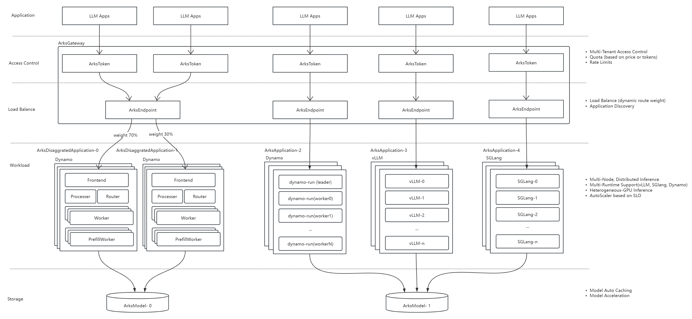

# Arks

简体中文 | [English](README.md)

*Arks* 是一个端到端的 Kubernetes 原生大语言模型应用管理框架，为云原生环境中的 LLM 推理工作负载提供健壮可扩展的基础设施。


## 核心特性

### 分布式推理能力
- *多节点调度*: 支持跨计算节点进行分布式推理。
- *异构计算* 兼容多种硬件类型（CPU/GPU等）。
- *多引擎支持*: 集成 vLLM、SGLang 和 Dynamo 推理引擎。
- *服务自动发现与负载均衡*: 动态注册应用实例并智能分配流量。
- *权重动态调整*: 实时响应流量与资源需求变化。
- *水平自动扩展 (HPA)*: 基于工作负载自动扩缩容。

### 模型管理
- *模型缓存优化*: 智能下载与缓存模型，降低冷启动延迟。
- *模型共享*: 跨推理节点共享模型，节省带宽与内存。
- *加速加载*: 利用本地缓存与预加载策略实现快速启动。

### 多租户管理
- *细粒度API令牌控制*: 支持权限范围化的令牌签发与管理。
- *灵活配额策略*: 可按总token数或计费策略实施用量限制。
- *请求限流*: 支持TPM（每分钟token数）、RPM（每分钟请求数）等多种限流策略。

## 系统架构



*Arks* 由以下核心组件构成：
- 网关层: 统一流量入口，负责请求路由与访问策略执行。
  - ArksToken: 提供细粒度多租户访问控制，支持:
    - API令牌认证
    - 配额管理（基于token用量或计费策略）
    - 速率限制（TPM/RPM）
  - ArksEndpoint: 动态管理路由规则与流量分发 different ArksApplication instances.
    - 支持权重动态路由
    - 实现应用自动发现
    - 根据负载实时调整流量
- 工作负载层: 每个ArksApplication包含多个运行时实例。 支持的运行时有vLLM, SGLang, Dynamo。每个运行时都以Kubernetes工作负载的方式部署:
  - 多节点分布式推理
  - 异构计算环境
  - 基于SLO的Kubernetes HPA自动扩缩容
- 存储层: 通过ArksModel管理模型存储。
  - 自动缓存模型减少冷启动时间
  - 支持跨应用/节点模型共享
  - 高通量模型加载与复用

More docs:

- [路线图](docs/roadmap.md)

- [模型使用指南](docs/model-usage.md)

- [应用管理指南](docs/application-usage.md)

- [网关配置指南](docs/gateway-usage.md)

- [监控](docs/monitoring.md)

## 快速开始
### 环境准备
- Kubernetes集群 (v1.20+)
- 配置好kubectl访问权限

### 安装部署
```bash
git clone https://github.com/scitix/arks.git
cd arks

# 安装 envoy 网关, lws依赖
kubectl create -f dist/dependency.yaml

# 安装 arks operator
kubectl create -f dist/operator.yaml

# 安装 arks gateway plugins
kubectl create -f dist/gateway.yaml
```

verification:
``` bash
# 检查所有组件状态是否为 ready
kubectl get deployment -n arks-operator-system
---
NAME                               READY   UP-TO-DATE   AVAILABLE   AGE
arks-gateway-plugins               1/1     1            1           22h
arks-operator-controller-manager   1/1     1            1           22h
arks-redis-master                  1/1     1            1           22h

# 检查 Envoy 网关状态
kubectl get deployment -n   envoy-gateway-system
--- 
NAME                                          READY   UP-TO-DATE   AVAILABLE   AGE
envoy-arks-operator-system-arks-eg-abcedefg   1/1     1            1           22h
envoy-gateway                                 1/1     1            1           22h

```

### 示例部署

安装部署: 
```bash
kubectl create -f examples/quickstart/quickstart.yaml
```

检查资源是否就绪:

```bash
# 检查所有自定义资源
kubectl get arksapplication,arksendpoint,arksmodel,arksquota,arkstoken,httproute -owide
---
# 确保REPLICAS与READY数量一致且PHASE为Running
NAME                                      PHASE     REPLICAS   READY   AGE   MODEL     RUNTIME   DRIVER
arksapplication.arks.ai/app-qwen   Running   1          1       21m   qwen-7b   sglang

NAME                                  AGE   DEFAULT WEIGHT
arksendpoint.arks.ai/qwen-7b   21m   5

# PHASE为 Ready
NAME                               AGE   MODEL                         PHASE
arksmodel.arks.ai/qwen-7b   21m   Qwen/Qwen2.5-7B-Instruct-1M   Ready

NAME                                   AGE
arksquota.arks.ai/basic-quota   21m

NAME                                     AGE
arkstoken.arks.ai/example-token   21m

NAME                                          HOSTNAMES   AGE
httproute.gateway.networking.k8s.io/qwen-7b               21m

```

### 测试验证

获取网关地址: 

``` bash
# 方案1：支持LoadBalancer的集群
LB_IP=$(kubectl get svc -n envoy-gateway-system --selector=gateway.envoyproxy.io/owning-gateway-name=arks-eg -o jsonpath='{.status.loadBalancer.ingress[0].ip}')
ENDPOINT="${LB_IP}:80"

# 方案2：开发环境使用端口转发
ENVOY_SERVICE=$(kubectl get svc -n envoy-gateway-system --selector=gateway.envoyproxy.io/owning-gateway-name=arks-eg -o jsonpath='{.items[0].metadata.name}')
kubectl -n envoy-gateway-system port-forward service/${ENVOY_SERVICE} 8888:80 &
ENDPOINT="localhost:8888"

```

发送测试请求:

``` bash
curl http://${ENDPOINT}/v1/chat/completions -k \
  -H "Authorization: Bearer sk-test123456" \
  -H "Content-Type: application/json" \
  -d '{"model": "qwen-7b", "messages": [{"role": "user", "content": "Hello, who are you?"}]}'
```

预期响应:
``` json
{
  "id":"xxxxxxxxx",
  "object":"chat.completion",
  "created": 12332454,
  "model":"qwen-7b",
  "choices":[{
    "index":0,
    "message":{
      "role":"assistant",
      "content":"I'm a large language model created by Alibaba Cloud. I go by the name Qwen.",
      "reasoning_content":null,
      "tool_calls":null
    },
    "logprobs":null,
    "finish_reason":"stop",
    "matched_stop":151645
  }],
  "usage":{
    "prompt_tokens":25,
    "total_tokens":45,
    "completion_tokens":20,
    "prompt_tokens_details":null
  }
}
```
### 环境清理
```bash
kubectl delete -f examples/quickstart/quickstart.yaml --ignore-not-found=true
kubectl delete -f dist/gateway.yaml
kubectl delete -f dist/operator.yaml
kubectl delete -f dist/dependency.yaml
```

## 编译构建
It is recommended to compile ARKS using Docker. Here are the relevant commands:
```
make docker-build-operator
make docker-build-gateway
make docker-build-scripts
```

## 开源协议

*Arks* is licensed under the Apache 2.0 License.

## 社区支持
For feedback, questions, or contributions, feel free to:
- Open an issue on GitHub
- Submit a pull request
